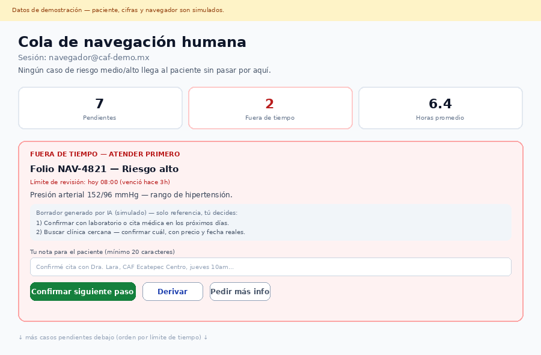
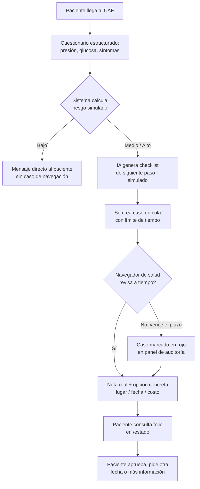
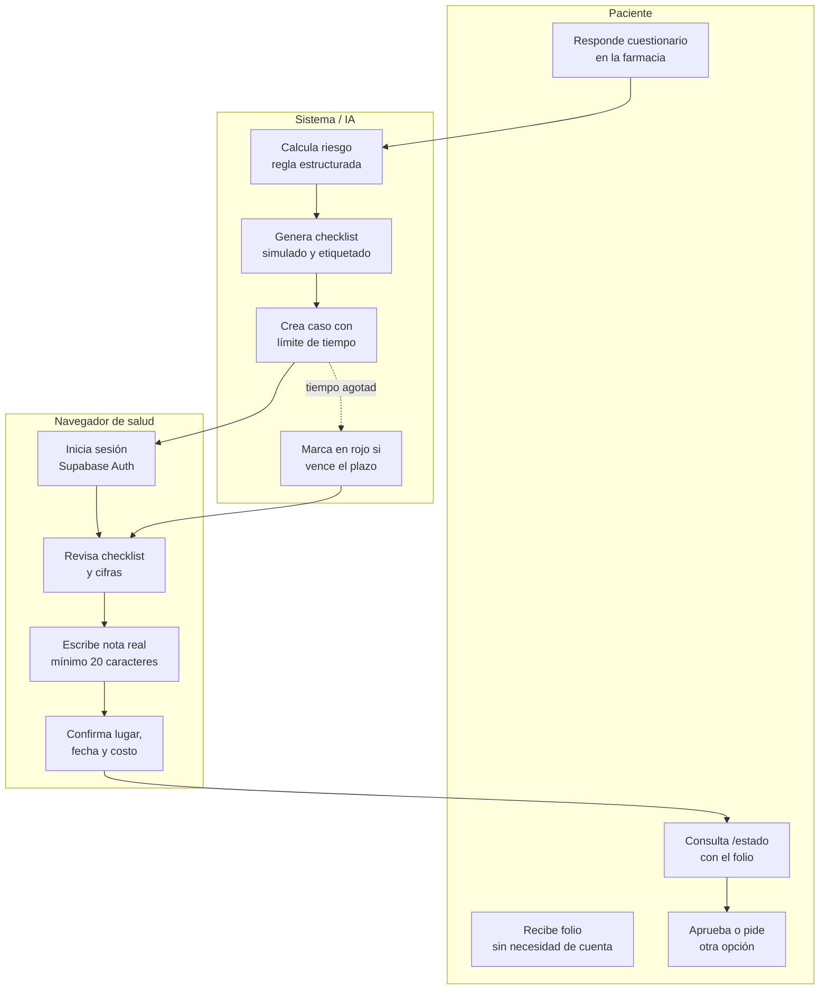

# PACKET — Detección a tratamiento: navegación humana (w05)

Business Bending · Cristina Meouchi (ADVERSARY) · Repair Flow, Crystal Ball Studio · Team 8

## Problema, en mis palabras

La detección temprana en México no falla por falta de precisión de la tecnología —
falla porque un resultado de riesgo, por sí solo, no le dice a nadie qué hacer
después. El Blueprint del equipo lo documenta: referencias fragmentadas, agendas
saturadas y falta de interoperabilidad convierten cada tamizaje positivo en un
callejón sin salida. Como ADVERSARY, mi pieza no construye el tamizaje en sí (eso
es de USER y de Gonzalo) ni el motor de pagos (Fernando) — construyo la garantía
de que ningún resultado de riesgo se queda solo con un número: un navegador de
salud humano real, medible y con tiempo límite, tiene que intervenir antes de que
el caso se cierre. Esta es literalmente mi declaración en el Blueprint: presionar
el modelo contra sistemas de cuidado que fallaron por depender solo de software, y
diseñar el requisito de respuesta humana para que el producto no pueda sustituir
en silencio el cuidado real.

## Usuaria exacta

Rosa, 58 años, Ecatepec. Va a una farmacia con consultorio adyacente (CAF) a
comprar medicamento para su esposo y aprovecha el chequeo gratuito de presión.
Le sale alta. Antes de esta pieza, eso es todo lo que se lleva a casa: un número
y un "ve al doctor" sin decirle cuál, cuándo, ni cuánto cuesta. Rosa no tiene
celular inteligente propio (usa el de su hijo cuando la visita) y no confía en
dejar sus datos en una app que no entiende.

## Definición de éxito

Antes de que cierre el módulo: un tamizaje de riesgo alto en `/tamizaje` crea
automáticamente un caso en la cola de `/navegador`; ese caso no se puede cerrar
sin que un navegador de salud autenticado escriba una nota real (mínimo 20
caracteres, no un "ok") y confirme una opción concreta de dónde, cuándo y cuánto;
y si pasa el límite de tiempo sin revisión, el caso se marca en rojo en el panel
de auditoría de `/navegador`.

## Mockup

## Diagrama de flujo

## Swimlane (más de un actor toca el proceso)

## El mejor intento del mundo (benchmark)

La mejor solución existente en el mundo para esto combina dos piezas que nadie ha
juntado exactamente así: el modelo original de navegación de pacientes de **Harold
Freeman** (Harlem Hospital, 1990) — acompañamiento humano desde un hallazgo
anormal hasta el tratamiento, que subió la supervivencia a 5 años de cáncer de
mama de 39% a 70%, y que dio origen a la ley federal estadounidense de navegación
de pacientes de 2005 — y el **servicio de detección de hipertensión en farmacias
del NHS** (Reino Unido), donde cada lectura se envía automáticamente al
expediente del médico de cabecera del paciente y los casos muy altos se refieren
en 24 horas con aviso directo a la clínica.

Mi pieza difiere/localiza así: México no tiene el hospital centralizado de
Freeman ni el registro único de médico de cabecera del NHS — pero sí tiene 6,518
consultorios adyacentes a farmacias (CAF), que ya resuelven 5 de cada 10
consultas de primer nivel en el país. Localizo el modelo sobre esa infraestructura
ya existente (Bet 2 del Blueprint), y agrego una salvaguarda que ni Freeman ni el
NHS necesitaban: los CAF tienen un conflicto de interés estructural ya
documentado (la farmacia vende el medicamento), así que el diseño obliga a que el
navegador de salud audite su propio tiempo de respuesta en público — el mecanismo
que en mi rol de ADVERSARY existe específicamente para que nadie pueda usar la
cola de navegación como una vitrina de venta disfrazada de cuidado.

## Párrafo a 3 años (charter ligero)

Si esta pieza funciona, en tres años se convierte en la capa de navegación humana
estándar detrás de cualquier tamizaje de farmacia en México, no solo del que
construye este equipo. Cada CAF que hace una prueba de presión, glucosa o de otro
tipo se conecta a la misma cola de navegadores certificados y pagados
específicamente por cerrar el círculo entre detección y tratamiento, con métricas
públicas de tiempo de respuesta que cualquier paciente puede consultar antes de
confiar en una farmacia. El éxito nunca se mide en cuántos tamizajes se hacen,
sino en cuántos casos de riesgo alto terminan en una cita confirmada.

## Scope cut (lo que NO construyo esta semana)

- El motor de pago y economía unitaria del tamizaje (declaración de Fernando/MONEY).
- La experiencia completa de comparación de opciones del paciente por presupuesto y preferencia (declaración de USER).
- Integración real con el sistema de citas de alguna clínica — el navegador escribe lugar/fecha/costo a mano esta semana.
- App móvil nativa o notificaciones push — solo folio de papel/texto + consulta web.
- Un LLM real conectado — el checklist es una plantilla simulada y etiquetada (permitido por el stack floor de esta semana).
- Registro público de navegadores o recuperación de contraseña — las cuentas se crean a mano en Supabase esta semana.

## Arquitectura + stack

| Capa | Herramienta | Notas |
|---|---|---|
| Frontend | Next.js 16 (App Router) + Tailwind CSS 4 | Reutiliza el patrón de w02-w04 |
| Datos | Supabase (Postgres) | RLS activado en las 5 tablas, sin policies para anon/authenticated |
| Acceso a datos | Service Role Key, solo en servidor | `crearClienteSupabaseServidor()`, marcado `server-only` |
| Autenticación | Supabase Auth (correo/contraseña) | Solo protege `/navegador` — el tamizaje y la consulta por folio son públicos (Condición 4) |
| Señal estructurada | Cuestionario de presión/glucosa/síntomas | La señal que exige el stack floor de esta semana |
| "IA" | Plantilla de checklist simulada, etiquetada | Sustituible por un LLM real sin cambiar el resto del sistema |
| Despliegue | Vercel | Igual que semanas anteriores |

## Plan de pruebas

1. Tamizaje con cifras normales → no crea caso, muestra mensaje directo con recomendaciones generales.
2. Tamizaje con presión ≥140/90 → crea caso de riesgo alto, con límite de 24 horas.
3. Intentar entrar a `/navegador` sin sesión → redirige a `/navegador/login`.
4. Iniciar sesión con credenciales incorrectas → rechazado con mensaje claro.
5. Iniciar sesión correcta → aparece el caso en la cola, ordenado por urgencia.
6. Intentar aprobar un caso con una nota de menos de 20 caracteres → bloqueado por el navegador y por el servidor.
7. Aprobar con una nota válida y una opción de lugar/fecha/costo → el caso pasa a "revisado" y aparece en `/estado` al buscar el folio.
8. Un caso cuyo límite de tiempo ya pasó → se marca en rojo ("fuera de tiempo") en el panel de `/navegador` antes de ser revisado.

